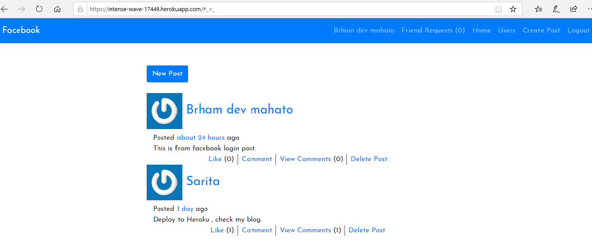

# Facebook Clone

> This Project replicates the core features of Facebook; Users can create posts, be friends with other users, like and comment posts.



## Built With

- Ruby on Rails
- Bootstrap
- Authentication with Devise and OAuth
- Unit and Integration tests with RSpec and Capybara

## Live Demo

[Live Demo Link](https://intense-wave-17449.herokuapp.com/)


## Getting Started

To get a local copy up and running follow these simple example steps.

### Prerequisites

- Ruby v2.6.x
- Rails v6.0.x
- PostgreSQL

### Setup

- Clone the Repository
```
git clone https://github.com/dev1980/facebook-clone.git
```
- Go to the project folder 
```
cd facebook-clone
```
### Install

- Open the .env.template file and add your postgreSQL credentials
```
PG_USERNAME='my_postgre_username'
PG_PASSWORD='my_postgre_password'
```
- Rename the .env.template file to just .env
- Run `bundle install`
- Run `rails db: create`
- Run `rails db: migrate`
- Run `rails db: seed` if you want to add some sample data.

### Usage

- Run `rails db:server`
- Go to [localhost](http://localhost:3000)

### Run tests

- Run `rails db:migrate RAILS_ENV=test`
- Run `rails spec`

### Deployment

- Run `heroku create`
- Push the project to heroku `git push heroku: master`


## Authors

👤 **Brham Dev Mahato**

- Github: [@dev1980](https://github.com/dev1980)
- Twitter: [@MahatoBrham](https://twitter.com/MahatoBrham)
- Linkedin: [dev1980](www.linkedin.com/in/dev1980)

👤 **Miguel Prada**

- Github: [@mapra99](https://github.com/mapra99)
- Twitter: [@MiguelPrada1](https://twitter.com/MiguelPrada1)
- Linkedin: [mprada](https://www.linkedin.com/in/mprada/)

## 🤝 Contributing

Contributions, issues, and feature requests are welcome!
